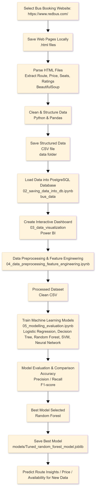

# Bus Route Data Collection & Analysis

A data pipeline project that collects, analyzes, and predicts bus route insights using web scraping and machine learning.

## Project Objective

The objective of this project is to collect real-world bus route data from online booking platforms and transform it into meaningful insights using data analysis, visualization, and machine learning techniques.

## System Architecture

## Architecture Explanation

### 1. Website Selection
A public bus booking website is selected as the data source to extract route, price, seat availability, and rating information.

### 2. Save Web Pages Locally
Web pages are saved as local HTML files to avoid repeated scraping and allow offline parsing.

### 3. HTML Parsing
The saved HTML files are parsed to extract structured data such as routes, prices, seats, and ratings.

### 4. Data Cleaning & Structuring
Raw extracted data is cleaned, formatted, and structured into tabular form.

### 5. Data Storage
The cleaned data is stored in CSV files and loaded into a PostgreSQL database for efficient access.

### 6. Interactive Dashboard
An interactive dashboard is created to visualize travel trends, pricing patterns, and operator performance for better decision-making.

### 7. Data Preprocessing & Feature Engineering
Data is prepared for machine learning by selecting and transforming relevant features.

### 8. Machine Learning & Prediction
Multiple ML models are trained, evaluated, and the best-performing model is used to make predictions on new data.

## Technologies Used

- Python
- Web Scraping (BeautifulSoup)
- Pandas & Data Processing
- PostgreSQL
- Power BI
- Machine Learning

## Machine Learning Models

The following models were trained and evaluated:
- Logistic Regression
- Decision Tree
- Random Forest
- Support Vector Machine
- Neural Network

Among all evaluated models, Random Forest achieved the best performance and was selected as the final model.

## Model Saving

The best-performing model is saved using the `joblib` format, allowing it to be reused for predictions without retraining.

## Key Findings

- Ticket prices are higher during peak travel hours.
- Certain operators consistently provide better value for money.
- Shorter journey durations tend to have slightly higher prices.

## Advantages

- Automates data collection from real-world websites
- Provides interactive insights for decision-making
- Scalable to multiple routes and cities
- Demonstrates a complete data engineering and ML pipeline

## Future Enhancements

- Include real-time scraping
- Add more routes and cities
- Deploy the model as a web application
- Implement price prediction using time-series models

## Conclusion

This project demonstrates how web scraping, data processing, visualization, and machine learning can be combined to build a complete data-driven solution for travel insights.
