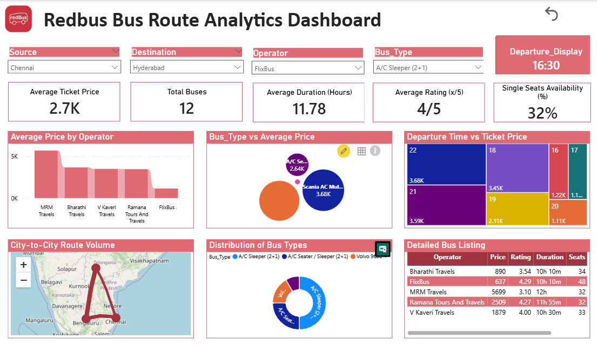

# RedBus Bus Route Analytics Dashboard

This dashboard provides an interactive analysis of bus routes, combining pricing, duration, ratings, operators, and travel patterns into a single, user-friendly interface. Users can filter data dynamically and make informed travel decisions.

---

## 1. Dashboard Overview

The dashboard includes:

- **Departure and Arrival Selection:** Dropdown menus to select the source and destination cities.
- **Filters:** Options to filter based on travel time, price range, seat availability, operator, and peak/off-peak hours.
- **Reset Button:** Clears all applied filters and selections, returning the dashboard to its default state.

---

## 2. Visual Explanations

### 2.1 Bus Route Table

**Description:**  
A detailed table showing all available bus routes based on selected filters.

**Columns Include:**

- **Bus_ID:** Unique identifier for each bus.
- **Departure & Arrival:** Start and end times of the journey.
- **Duration:** Total travel time (hours and minutes).
- **Seats & Single_Seats:** Number of available seats, highlighting solo travel options.
- **Price:** Fare for the selected route.
- **Onwards:** Indicates if the journey is a one-way or onward trip.
- **Rating & Rating_Count:** Average user rating and number of reviews.
- **Price_Category:** Categorizes fares as low, medium, or high.
- **Departure_Hour & Is_Peak_Hour:** Hour of departure and whether it falls in peak travel time.
- **Operator Columns:** Binary columns indicating which operator runs the bus.

**Purpose:**  
Helps users compare all available routes with complete details at a glance.

---

### 2.2 Price Distribution Plot

**Description:**  
A histogram showing the distribution of ticket prices for the selected route.

**Purpose:**  
- Identify affordable or premium travel options.  
- Observe fare trends and anomalies.  

---

### 2.3 Duration Analysis

**Description:**  
A bar or line chart showing journey duration for different buses.

**Purpose:**  
- Compare travel times across operators and routes.  
- Quickly identify fastest or longest options.

---

### 2.4 Operator Performance

**Description:**  
A bar chart displaying operators and their ratings or number of buses.

**Purpose:**  
- Identify reliable operators based on user ratings.  
- Analyze market share or frequency of buses per operator.

---

### 2.5 Peak Hour Analysis

**Description:**  
A bar chart showing the number of buses operating during peak and off-peak hours.

**Purpose:**  
- Understand travel patterns.  
- Plan journeys to avoid crowded timings.

---

### 2.6 Rating Analysis

**Description:**  
A histogram of bus ratings to see customer satisfaction levels.

**Purpose:**  
- Identify highly rated buses for a better travel experience.  
- Filter out poorly rated buses if desired.

---

### 2.7 Reset Button Feature

**Functionality:**  

- The **Reset** button clears all selected filters and dropdown choices.  
- Returns the dashboard to its default state, showing all available data.  
- Enhances usability by allowing users to start fresh without manually undoing each filter.

**Usage:**  
Click the **Reset** button anytime to quickly restore all visuals and tables to default settings.

---

## 3. Summary

This dashboard empowers users to:

- Compare bus routes based on price, duration, ratings, and operator.  
- Filter data dynamically for personalized travel planning.  
- Quickly reset filters to explore alternative options.  

Overall, it offers a comprehensive view of bus travel options, enabling informed decision-making for travelers.
